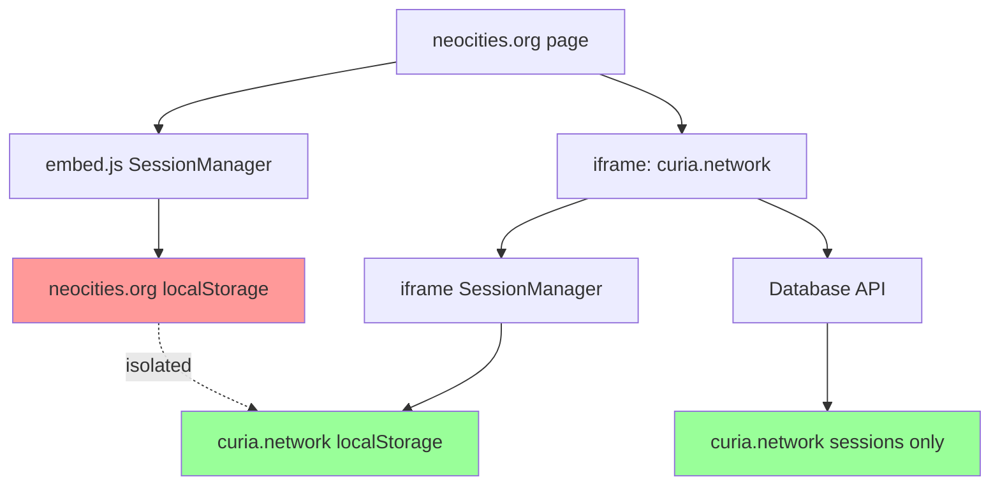
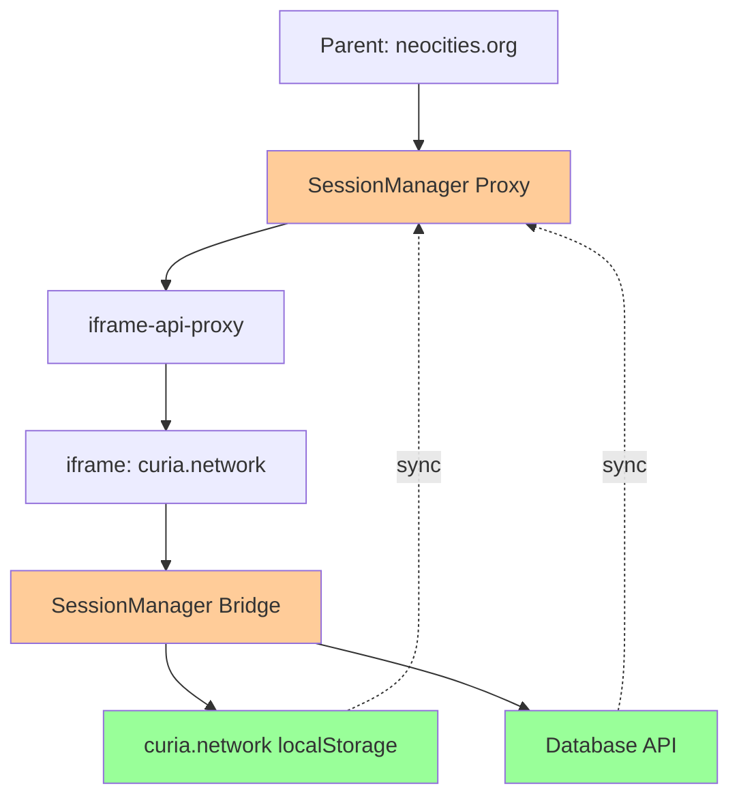

# Cross-Domain Session Persistence Research

**Date**: January 25, 2025  
**Issue**: Sessions created in iframes disappear on third-party domains, causing "(fallback)" display and session loss  
**Status**: Research & Solution Design

## 📋 Problem Statement

### Issue Summary
When the Curia embed runs on third-party domains (e.g., `neocities.org`), sessions are successfully created but fail to persist across page loads. Users see "(fallback)" in the profile menu and previously created sessions "disappear."

### Symptoms Observed
1. **On curia.network**: Sessions persist correctly, full session switching works
2. **On neocities.org**: 
   - Sessions created successfully in iframe
   - Sessions appear briefly but then vanish
   - Profile menu shows "(fallback)" and 0 available sessions
   - Database sync returns 0 sessions despite having active sessions

## 🔍 Root Cause Analysis

### The localStorage Domain Isolation Problem



### Detailed Flow Analysis

#### ✅ Session Creation (Works)
1. User authenticates in iframe (`curia.network`)
2. Session stored in `curia.network` localStorage ✅
3. Session data sent to parent via `postMessage` ✅
4. Parent receives session data ✅

#### ❌ Session Persistence (Fails)
1. Parent (`neocities.org`) stores session in `neocities.org` localStorage ❌
2. iframe has session in `curia.network` localStorage ✅
3. **Domain isolation**: Two separate localStorage instances ❌

#### ❌ Database Sync (Fails)
1. Parent calls `/api/auth/sessions` via iframe-api-proxy ✅
2. API returns sessions for `curia.network` domain only ❌
3. Parent's `neocities.org` sessions not in database ❌
4. Sync results in 0 sessions ❌

### Evidence from Logs

**neocities.org** (Problem):
```
[SessionManager] Initialized with 0 sessions (sync deferred until configured)
[SessionManager] No sessions to sync initially (API proxy ready)
// After creating session...
[UserProfile] 🔧 All sessions count: 0
[UserProfile] ⚠️ No active session found, falling back to userProfile data
```

**curia.network** (Working):
```
[SessionManager] Initialized with 5 sessions (sync deferred until configured)
[SessionManager] API proxy database sync success: 1 sessions
[UserProfile] 🔧 All sessions count: 5
[UserProfile] ✅ Using active session data for header
```

## 🚀 Solution Architecture

### Proposed Solution: Cross-Domain Session Bridge

Implement a **session bridge** via the existing `iframe-api-proxy` to synchronize session state between parent and iframe domains.



### Core Concept

1. **Parent SessionManager** becomes a **proxy** that delegates storage operations to iframe
2. **iframe SessionManager** becomes the **authoritative source** for session state
3. **All session operations** (get, set, remove, sync) flow through the iframe-api-proxy
4. **Single source of truth**: `curia.network` localStorage + database

### New Message Types

```typescript
// Session Bridge Messages
interface SessionBridgeMessage {
  type: 'session-bridge';
  operation: 'get' | 'set' | 'remove' | 'sync' | 'list';
  data?: any;
  requestId: string;
}

// Operations
type SessionOperation = 
  | { operation: 'get'; sessionId: string }
  | { operation: 'set'; session: SessionData }
  | { operation: 'remove'; sessionId: string }
  | { operation: 'sync'; activeToken?: string }
  | { operation: 'list' }
```

## 📋 Implementation Plan

### Phase 1: Infrastructure Setup
1. **Add session bridge message types** to iframe-api-proxy
2. **Create SessionBridge server** in iframe
3. **Update parent SessionManager** to use proxy pattern

### Phase 2: Core Session Operations
1. **Implement get/set/remove** operations via bridge
2. **Replace localStorage access** in parent SessionManager
3. **Test basic session persistence**

### Phase 3: Database Sync Integration
1. **Route database sync** through iframe bridge
2. **Update periodic sync** to use bridge
3. **Handle cross-tab synchronization**

### Phase 4: Error Handling & Optimization
1. **Add fallback mechanisms** for bridge failures
2. **Optimize message batching** for performance
3. **Add comprehensive logging**

## 🗂️ Files to Modify

### 1. iframe-api-proxy Package

#### `iframe-api-proxy/src/types/MessageTypes.ts`
- Add `SessionBridgeMessage` interface
- Add session operation types
- Update `ProxyMessage` union type

#### `iframe-api-proxy/src/server/ApiProxyServer.ts`
- Add `SessionBridge` class integration
- Handle session bridge messages
- Route to SessionBridge operations

#### `iframe-api-proxy/src/client/ApiProxyClient.ts`
- Add session bridge client methods:
  - `getSession(sessionId: string)`
  - `setSession(session: SessionData)`
  - `removeSession(sessionId: string)`
  - `syncSessions(activeToken?: string)`
  - `listSessions()`

### 2. Host Service

#### `host-service/src/lib/SessionManager.ts`
**Major Refactor**: Convert to proxy pattern
- Replace localStorage operations with iframe-api-proxy calls
- Maintain same public API for backward compatibility
- Add bridge connection status tracking
- Implement fallback for bridge failures

#### `host-service/src/lib/embed/services/SessionBridge.ts` (New)
- Server-side session bridge implementation
- Handle session operations on iframe side
- Manage localStorage and database sync
- Cross-tab synchronization logic

#### `host-service/src/app/embed/page.tsx`
- Initialize SessionBridge alongside ApiProxyServer
- Ensure bridge is ready before SessionManager operations

### 3. Session Manager Architecture

#### Current Architecture
```typescript
// Parent Domain (neocities.org)
SessionManager --> localStorage (neocities.org) ❌
SessionManager --> Database API (via proxy) ❌

// iframe Domain (curia.network) 
SessionManager --> localStorage (curia.network) ✅
```

#### New Architecture
```typescript
// Parent Domain (neocities.org)
SessionManager --> iframe-api-proxy --> SessionBridge ✅

// iframe Domain (curia.network)
SessionBridge --> localStorage (curia.network) ✅
SessionBridge --> Database API (direct) ✅
```

## 🔧 Detailed Implementation

### 1. Message Types (`iframe-api-proxy/src/types/MessageTypes.ts`)

```typescript
export interface SessionBridgeMessage {
  type: 'session-bridge';
  operation: 'get' | 'set' | 'remove' | 'sync' | 'list';
  requestId: string;
  data?: {
    sessionId?: string;
    session?: SessionData;
    activeToken?: string;
  };
}

export interface SessionBridgeResponse {
  type: 'session-bridge-response';
  requestId: string;
  success: boolean;
  data?: any;
  error?: string;
}
```

### 2. SessionBridge Server (`host-service/src/lib/embed/services/SessionBridge.ts`)

```typescript
export class SessionBridge {
  private sessionManager: SessionManager;
  
  constructor() {
    this.sessionManager = sessionManager; // iframe's SessionManager
  }
  
  async handleOperation(operation: string, data?: any): Promise<any> {
    switch (operation) {
      case 'get':
        return this.sessionManager.getSession(data.sessionId);
      case 'set':
        return this.sessionManager.addSession(data.session);
      case 'remove':
        return this.sessionManager.removeSession(data.sessionId);
      case 'sync':
        return this.sessionManager.syncWithDatabase();
      case 'list':
        return this.sessionManager.getAllSessions();
      default:
        throw new Error(`Unknown operation: ${operation}`);
    }
  }
}
```

### 3. Parent SessionManager Proxy (`host-service/src/lib/SessionManager.ts`)

```typescript
export class SessionManager {
  private apiProxy: ApiProxyClient | null = null;
  private bridgeReady: boolean = false;
  
  // Replace localStorage operations with bridge calls
  private async getSessionsFromBridge(): Promise<SessionData[]> {
    if (!this.apiProxy || !this.bridgeReady) {
      return []; // Fallback to empty state
    }
    
    try {
      const response = await this.apiProxy.sendSessionBridgeRequest('list');
      return response.data || [];
    } catch (error) {
      console.warn('[SessionManager] Bridge operation failed:', error);
      return [];
    }
  }
  
  public async addSession(sessionData: SessionData): Promise<void> {
    if (!this.apiProxy || !this.bridgeReady) {
      console.warn('[SessionManager] Bridge not ready, session not persisted');
      return;
    }
    
    await this.apiProxy.sendSessionBridgeRequest('set', { session: sessionData });
  }
  
  // ... similar for other operations
}
```

## 🧪 Testing Strategy

### 1. Unit Tests
- SessionBridge operation handling
- Message serialization/deserialization
- Error handling and fallbacks

### 2. Integration Tests
- Parent-iframe session synchronization
- Database sync through bridge
- Cross-tab session updates

### 3. Domain Testing
- Test on `localhost` (same-domain)
- Test on `neocities.org` (cross-domain)
- Test session persistence across page reloads
- Test session switching functionality

### 4. Edge Cases
- Bridge connection failures
- iframe load delays
- Network timeouts
- Multiple rapid session operations

## 📊 Success Metrics

### Before (Current State)
- ❌ neocities.org: 0 sessions after refresh
- ❌ "(fallback)" in profile menu
- ❌ Session switching broken on third-party domains

### After (Expected Results)
- ✅ neocities.org: Sessions persist across reloads
- ✅ Proper session names in profile menu
- ✅ Full session switching functionality
- ✅ Consistent behavior between curia.network and third-party domains

## 🚧 Implementation Phases

### Phase 1: Foundation (1-2 days)
1. Add message types to iframe-api-proxy
2. Create basic SessionBridge class
3. Update ApiProxyServer to handle session messages
4. Add client methods to ApiProxyClient

### Phase 2: Core Implementation (2-3 days)
1. Refactor parent SessionManager to proxy pattern
2. Implement all session operations via bridge
3. Test basic get/set/remove functionality

### Phase 3: Database & Sync (1-2 days)
1. Route database sync through bridge
2. Update periodic sync logic
3. Handle cross-tab synchronization

### Phase 4: Testing & Polish (1-2 days)
1. Comprehensive testing on multiple domains
2. Error handling and fallback mechanisms
3. Performance optimization
4. Documentation updates

## 🎯 Expected Outcome

After implementation, the session management system will:

1. **Work consistently** across all domains (curia.network, neocities.org, any third-party site)
2. **Persist sessions** correctly using the iframe as the authoritative source
3. **Sync with database** properly through the iframe's domain context
4. **Eliminate "(fallback)" issues** by maintaining proper session state
5. **Enable full session switching** on third-party domains

The solution leverages the existing iframe-api-proxy infrastructure, ensuring minimal disruption to the current architecture while solving the fundamental cross-domain localStorage isolation problem. 