# iframe Lifecycle Analysis & Dedicated iframe Solution

**Date**: January 25, 2025  
**Issue**: Cross-domain session persistence requires understanding iframe architecture  
**Status**: Analysis Complete & Solution Design

## 📋 iframe Lifecycle Analysis

### **🔍 Complete iframe Flow:**

```mermaid
sequenceDiagram
    participant P as Parent (neocities.org)
    participant E as embed.js
    participant A as Auth iframe (curia.network)
    participant F as Forum iframe (embed.curia.network)
    participant S as SessionManager
    
    P->>E: Load embed script
    E->>A: 1. Create auth iframe
    E->>S: Configure SessionManager with apiProxy
    Note over A: curia.network/embed<br/>Has curia.network localStorage ✅
    
    A->>E: Auth complete message
    E->>F: 2. Create forum iframe (hidden)
    Note over F: embed.curia.network<br/>Has embed.curia.network localStorage ❌
    
    E->>E: 3. Switch API proxy to forum iframe
    E->>F: 4. Show forum iframe
    Note over A: Auth iframe remains in DOM<br/>but unused ⚠️
    
    S->>F: Database sync via API proxy
    Note over F: ❌ FAILS - wrong domain!
```



### **🏗️ Current Architecture:**

#### **Phase 1: Auth Phase** (Works ✅)
1. **Auth iframe created**: `${hostServiceUrl}/embed` → `curia.network/embed`
2. **API proxy points to**: Auth iframe ✅
3. **SessionManager database calls**: Work via auth iframe ✅
4. **localStorage domain**: `curia.network` ✅

#### **Phase 2: Forum Phase** (Breaks ❌)
1. **Forum iframe created**: `${forumUrl}` → `embed.curia.network` or `forum.curia.network`
2. **API proxy switches to**: Forum iframe ❌
3. **SessionManager database calls**: Fail (wrong domain) ❌
4. **localStorage domain**: `embed.curia.network` ❌

### **🚨 Critical Discovery:**

**The auth iframe NEVER gets destroyed!** It remains in the DOM but becomes unused when the API proxy switches to the forum iframe.

```typescript
// Auth iframe creation (Phase 1)
const authIframe = this.iframeManager.createAuthIframe(this.config);
this.container.appendChild(authIframe); // ✅ Auth iframe in DOM

// Forum iframe creation (Phase 2)  
const forumIframe = this.iframeManager.createForumIframe(config, authContext, container);
this.apiProxy.setActiveIframe(forumIframe); // ❌ API proxy switches away from auth iframe

// Auth iframe is still in DOM but orphaned!
```

### **📊 Domain Mapping:**

| iframe Type | Domain | localStorage | Database API | Status |
|-------------|--------|--------------|--------------|---------|
| **Auth iframe** | `curia.network` | ✅ Works | ✅ Works | 🟡 Orphaned after forum phase |
| **Forum iframe** | `embed.curia.network` | ❌ Isolated | ❌ Fails | 🟢 Active for UI |
| **Parent** | `neocities.org` | ❌ Isolated | ❌ Fails | 🟢 Needs sessions |

## 🚀 **Dedicated iframe Solution**

### **Core Concept: Persistent Session Service iframe**

Instead of trying to bridge between 3 domains, create a **dedicated session service iframe** that stays alive and handles all session operations.


### **🎯 Solution Architecture:**

#### **1. Create Dedicated Session Service iframe**
- **Domain**: `curia.network/session-service` (new endpoint)
- **Purpose**: Exclusive session management operations
- **Lifecycle**: Created once, never destroyed
- **Position**: Hidden, persistent throughout embed lifecycle

#### **2. Parent SessionManager → Service Proxy Pattern**
```typescript
export class SessionManager {
  private sessionServiceIframe: HTMLIFrameElement | null = null;
  private serviceProxy: SessionServiceProxy | null = null;
  
  // All operations proxy to session service iframe
  public async addSession(session: SessionData): Promise<void> {
    return this.serviceProxy.addSession(session);
  }
  
  public async syncWithDatabase(): Promise<void> {
    return this.serviceProxy.syncWithDatabase();
  }
}
```

#### **3. Session Service iframe (`/session-service` endpoint)**
```typescript
// New endpoint: host-service/src/app/session-service/page.tsx
export default function SessionServicePage() {
  return <SessionServiceProvider />;
}

// Components: Lightweight session management service
const SessionServiceProvider = () => {
  useEffect(() => {
    const sessionService = new SessionService();
    sessionService.initialize();
  }, []);
  
  return <div>Session Service Active</div>;
};
```

## 📋 **Implementation Plan**

### **Phase 1: Session Service Infrastructure**

#### **1.1 Create Session Service Endpoint**
```typescript
// host-service/src/app/session-service/page.tsx
// Lightweight React component that initializes session service
```

#### **1.2 Session Service Provider**
```typescript
// host-service/src/lib/embed/services/SessionService.ts
export class SessionService {
  private sessionManager: SessionManager; // iframe's SessionManager
  
  public initialize(): void {
    // Listen for session operation messages from parent
    window.addEventListener('message', this.handleMessage.bind(this));
    
    // Notify parent that service is ready
    this.notifyReady();
  }
  
  private async handleMessage(event: MessageEvent): Promise<void> {
    if (event.data.type === 'session-operation') {
      const result = await this.executeOperation(event.data.operation, event.data.data);
      this.sendResponse(event.data.requestId, result);
    }
  }
}
```

#### **1.3 Session Service Proxy (Parent)**
```typescript
// host-service/src/lib/SessionServiceProxy.ts
export class SessionServiceProxy {
  private iframe: HTMLIFrameElement;
  private pendingRequests: Map<string, any> = new Map();
  
  public async addSession(session: SessionData): Promise<void> {
    return this.sendRequest('addSession', { session });
  }
  
  public async syncWithDatabase(): Promise<void> {
    return this.sendRequest('syncWithDatabase');
  }
  
  private async sendRequest(operation: string, data?: any): Promise<any> {
    const requestId = generateRequestId();
    
    return new Promise((resolve, reject) => {
      this.pendingRequests.set(requestId, { resolve, reject });
      
      this.iframe.contentWindow.postMessage({
        type: 'session-operation',
        operation,
        data,
        requestId
      }, '*');
    });
  }
}
```

### **Phase 2: Integration with Current Architecture**

#### **2.1 Update InternalPluginHost**
```typescript
export class InternalPluginHost {
  private sessionServiceIframe: HTMLIFrameElement | null = null;
  
  constructor(...) {
    // Create session service iframe first (before auth iframe)
    this.createSessionServiceIframe();
    
    // Configure SessionManager to use session service
    sessionManager.configureWithService(this.sessionServiceProxy);
  }
  
  private createSessionServiceIframe(): void {
    const iframe = document.createElement('iframe');
    iframe.src = `${this.hostServiceUrl}/session-service`;
    iframe.style.display = 'none'; // Hidden service iframe
    iframe.style.position = 'absolute';
    iframe.style.width = '1px';
    iframe.style.height = '1px';
    
    document.body.appendChild(iframe); // Append to body, not container
    this.sessionServiceIframe = iframe;
    
    this.sessionServiceProxy = new SessionServiceProxy(iframe);
  }
}
```

#### **2.2 SessionManager Refactor**
```typescript
export class SessionManager {
  private serviceProxy: SessionServiceProxy | null = null;
  private mode: 'local' | 'service' = 'local';
  
  public configureWithService(proxy: SessionServiceProxy): void {
    this.serviceProxy = proxy;
    this.mode = 'service';
    console.log('[SessionManager] Configured to use session service');
  }
  
  public async addSession(session: SessionData): Promise<void> {
    if (this.mode === 'service' && this.serviceProxy) {
      return this.serviceProxy.addSession(session);
    }
    
    // Fallback to local mode (existing implementation)
    return this.addSessionLocal(session);
  }
}
```

### **Phase 3: Advanced Features**

#### **3.1 Cross-Tab Synchronization**
- Session service broadcasts changes to all parent windows
- Parent SessionManagers listen for cross-tab updates

#### **3.2 Fallback Mechanisms**
- Local mode when service iframe fails to load
- Retry logic for service communication failures

#### **3.3 Performance Optimization**
- Batch multiple operations
- Cache recent operations
- Debounce frequent calls

## 🔧 **Technical Implementation Details**

### **Session Service Messages**
```typescript
interface SessionOperationMessage {
  type: 'session-operation';
  operation: 'addSession' | 'removeSession' | 'syncWithDatabase' | 'getAllSessions';
  data?: any;
  requestId: string;
}

interface SessionOperationResponse {
  type: 'session-operation-response';
  requestId: string;
  success: boolean;
  data?: any;
  error?: string;
}
```

### **Session Service Lifecycle**


## 🎯 **Advantages of Dedicated iframe Solution**

### **✅ Solves Core Problems:**
1. **Single domain for sessions**: All operations happen on `curia.network`
2. **Persistent service**: Never destroyed, always available
3. **Clean separation**: Session logic isolated from auth/forum concerns
4. **Backward compatibility**: Existing APIs remain unchanged

### **✅ Architectural Benefits:**
1. **No interference with forum iframe**: Forum can be any domain
2. **Cleaner API proxy usage**: Auth/forum iframes focus on their domains
3. **Scalable**: Can add more service operations (user preferences, etc.)
4. **Testable**: Service iframe can be tested independently

### **✅ Performance Benefits:**
1. **Reduced complexity**: No complex domain switching logic
2. **Optimized for sessions**: Purpose-built for session operations
3. **Persistent connection**: No repeated iframe creation/destruction

## 📊 **Expected Outcomes**

### **Before (Current State):**
- ❌ Sessions disappear on third-party domains
- ❌ "(fallback)" appears in profile menu
- ❌ Database sync fails after forum phase
- ❌ Inconsistent behavior across domains

### **After (With Dedicated iframe):**
- ✅ Sessions persist on all domains
- ✅ Proper session names in profile menu
- ✅ Database sync works throughout lifecycle
- ✅ Consistent behavior everywhere
- ✅ Clean separation of concerns

## 🚧 **Implementation Timeline**

### **Week 1: Infrastructure**
- Create `/session-service` endpoint
- Implement SessionService class
- Create SessionServiceProxy
- Basic message passing

### **Week 2: Integration**
- Update InternalPluginHost
- Refactor SessionManager
- Test basic operations

### **Week 3: Advanced Features**
- Cross-tab synchronization
- Error handling & fallbacks
- Performance optimization

### **Week 4: Testing & Polish**
- Comprehensive testing across domains
- Edge case handling
- Documentation

## 🎯 **Next Steps**

1. **Approve architecture**: Confirm this approach vs. the previous session bridge idea
2. **Start with Phase 1**: Create basic session service infrastructure
3. **Incremental testing**: Test each phase thoroughly before proceeding
4. **Maintain backward compatibility**: Ensure existing embeds continue working

The dedicated iframe solution is architecturally cleaner, easier to test, and solves the fundamental domain isolation problem without complex bridging logic. 